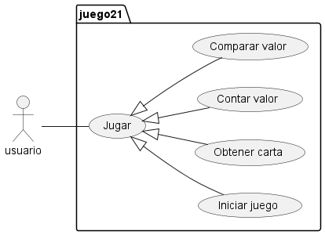
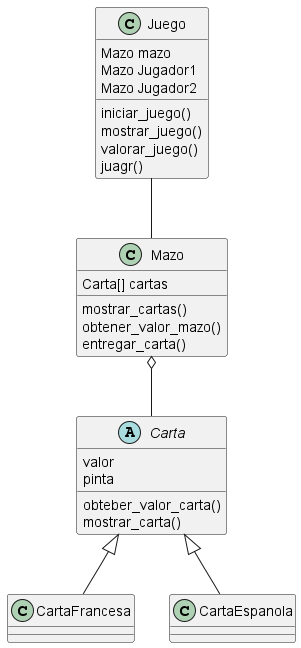

# Ventiuna

El juego de ventiuno es un juego de cartas, con una o más barajas perminte a dos jugadores pedir cartas hasta estar lo más proximo al valor de 21 sin pasarse.

En esta versión simularemos un 21 de un jugador vs. el repartidor.

El repatidor estará obligado a repartir cartas hasta igualar al jugador y solo se plantará cuando lo iguale o supere.

El jugador solo podrá ganar si tiene mejor puntaje que el repartidor sin pasarse de 21.

Las cartas númericas suman su valor, las cartas como "__J, Q, K__" suman 10 y el As vale 1 o 11 según convenga, solo puede valer 11 sin con este valor no excede el valor de 21 de lo contrario solo suma 1.

## Diagramas:

- Diagrama de casos de usos:

- Diagramma de clases:

- Diagrama de secuencia: